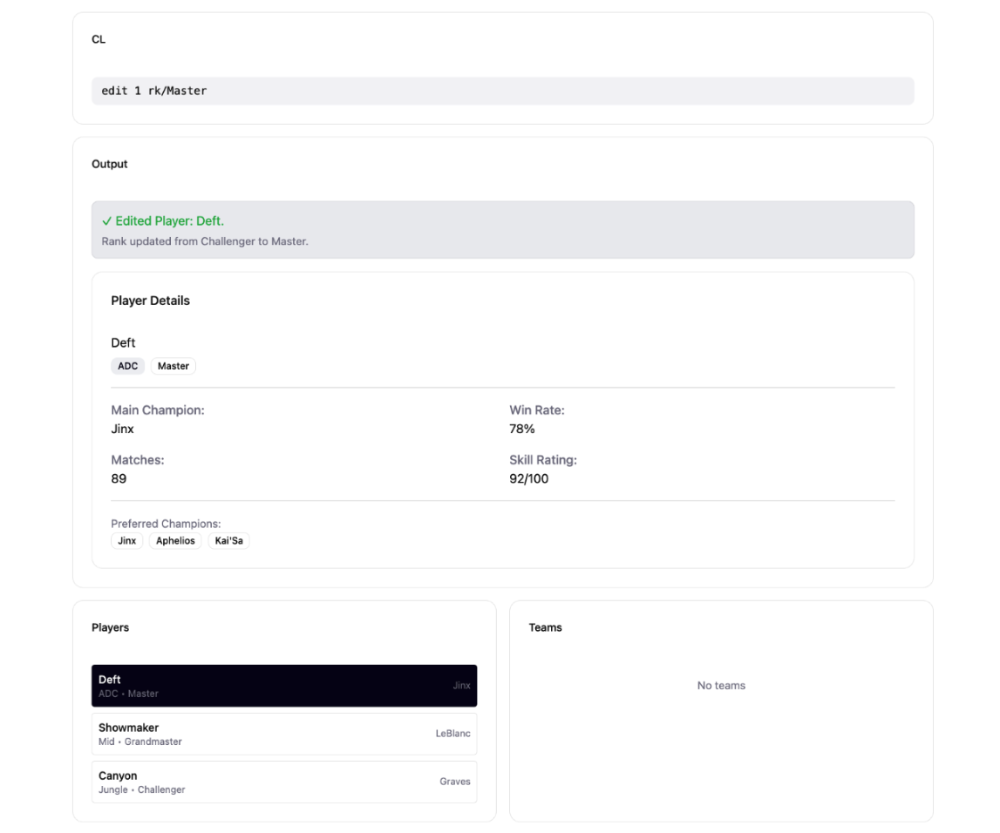

* This project is a **desktop application for esports coaches** (League of Legends), called _SummonersBook_, optimized for a fast Command-Line Interface (CLI) experience. The GUI provides immediate visual feedback for commands executed.
  * Example usages:
    * Managing a database of players with attributes such as Name, ID, Role, Rank, and Champion.
    * Automatically forming teams, disbanding teams, and tracking team performance.
    * Quickly executing commands such as add, view, delete, find, group, ungroup, help, and exit.
* The project is named `SummonersBook` as a play on _AddressBook_ and its focus on managing esports teams.
* For the detailed documentation of this project, see the **[SummonersBook Product Website](#)**.
* This project is based on the AddressBook-Level3 project created by the [SE-EDU initiative](https://se-education.org).
