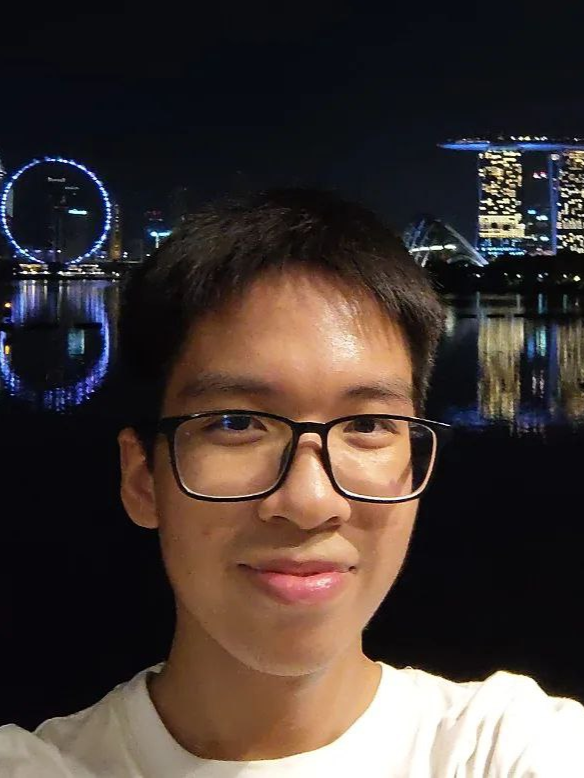
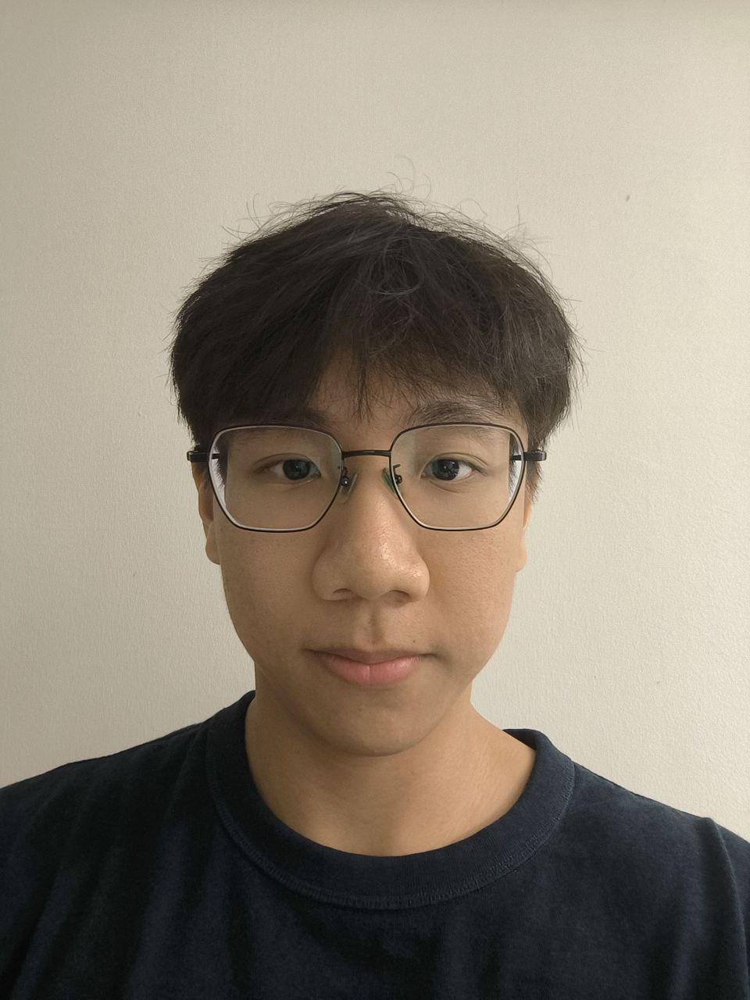
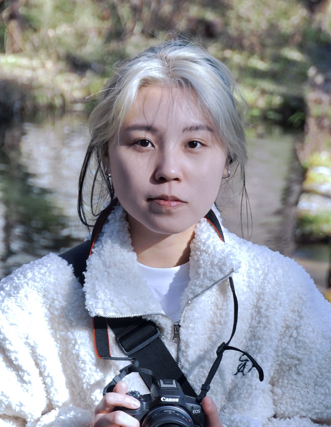

# About Us

We are a team based in the [School of Computing, National University of Singapore](http://www.comp.nus.edu.sg).

You can reach us at the email `seer[at]comp.nus.edu.sg`

## Project team

### Bryan Koh

[[github](https://github.com/BryanKCodes)]
[[portfolio](team/bryankcodes.md)]

* Role: Team Lead
* Responsibilities:
    * Overall project coordination
    * Scheduling and tracking

### Nguyen Tuan Duong

[[github](http://github.com/tuanduong18)]
[[portfolio](team/tuanduong18.md)]

* Role: Developer
* Responsibilities: Do the work

### Justin Wong

[[github](http://github.com/fatkidddd)]
[[portfolio](team/fatkidddd.md)]

* Role: Developer
* Responsibilities: Code quality + getting work done

### Valerie Lim

[[github](http://github.com/valeriexylim)]
[[portfolio](team/valeriexylim.md)]

* Role: Developer
* Responsibilities: UI, Documentation

### Zhao Xin Tong

[[github](http://github.com/landonzhao)]
[[portfolio](team/landonzhao.md)]

* Role: Developer
* Responsibilities: Getting work done
